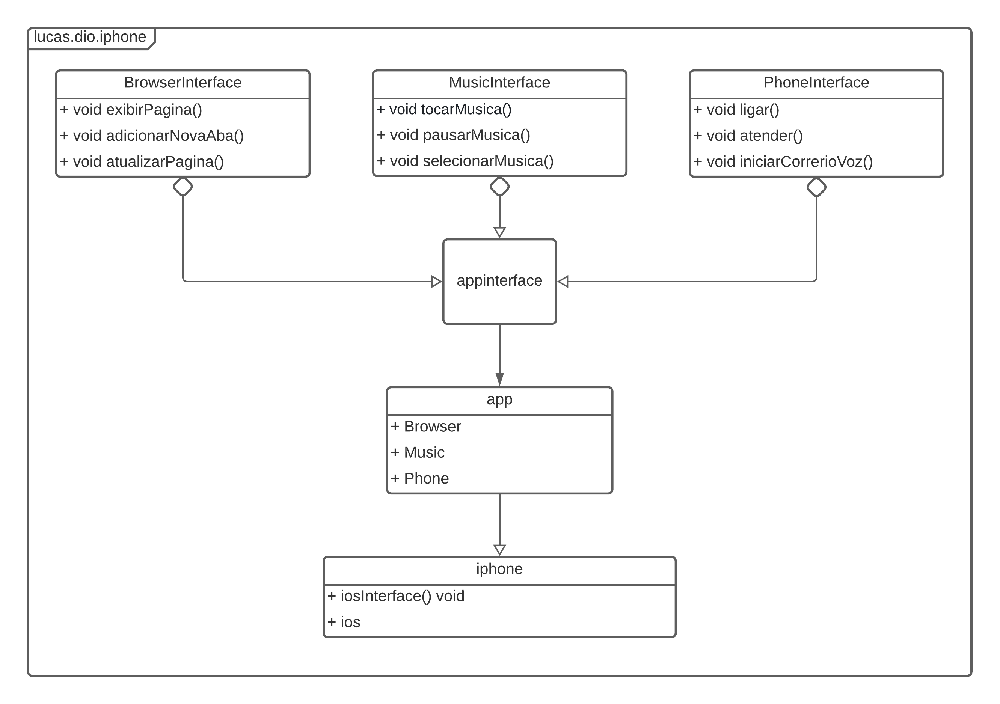

# `📱 iPhone - Desafio de Modelagem e Diagramação`

Neste projeto, realizei a modelagem UML e implementação em Java do iPhone, representando suas funcionalidades como Reprodutor Musical, Celular e Navegador na Internet. O desafio foi inspirado no lançamento do iPhone de 2007.

## Diagrama UML

Foi utilizado uma ferramenta de UML para criar o diagrama de classes e interfaces que representam os apps do iPhone:

## Funcionalidades

### `app` Músic
- `tocar()`: Inicia a reprodução de uma música.
- `pausar()`: Pausa a música em reprodução.
- `selecionarMusica()`: Seleciona uma música para tocar.

### `app` Phone
- `ligar()`: Inicia uma chamada no iPhone.
- `atender()`: Atende uma chamada no iPhone.
- `iniciarCorreioVoz()`: Inicia o correio de voz no iPhone.

### `app` Browser
- `exibirPagina()`: Exibe a página atual.
- `adicionarNovaAba()`: Adiciona uma nova página no navegador.
- `atualizarPagina()`: Atualiza a página atual.

## Implementação em Java

A implementação em Java está organizada nos seguintes diretórios e arquivos:

### Pacote `app`

- `Music.java`: Implementa as funcionalidades do `app` Music.
- `Phone.java`: Implementa as funcionalidades do `app` Phone.
- `Browser.java`: Implementa as funcionalidades do `app` Browser.

### Pacote `appinterface`

- `MusicInterface.java`: Define a interface para o `app` Music.
- `PhoneInterface.java`: Define a interface para o `app` Phone.
- `BrowserInterface.java`: Define a interface para o `app` Browser.

### Pacote `iphone`

- `Ios.java`: Implementa as funcionalidades do iPhone (iOS).
- `IosInterface.java`: Define a interface para o iPhone (iOS).

### Diretório `src`

- `iPhone.java`: Contém a classe principal que inicia a aplicação do iPhone.

Essa organização facilita a localização das classes e interfaces correspondentes às funcionalidades do iPhone. Você pode explorar esses arquivos para ver a implementação detalhada de cada componente.

## Sobre o Desenvolvedor

Meu nome é João Lucas, estou cursando o Bootcamp Backend Java do Santander & DIO.

## Conecte-se comigo

| Instagram | LinkedIn | Perfil DIO |
|---------|-----------|----------|
||| |

